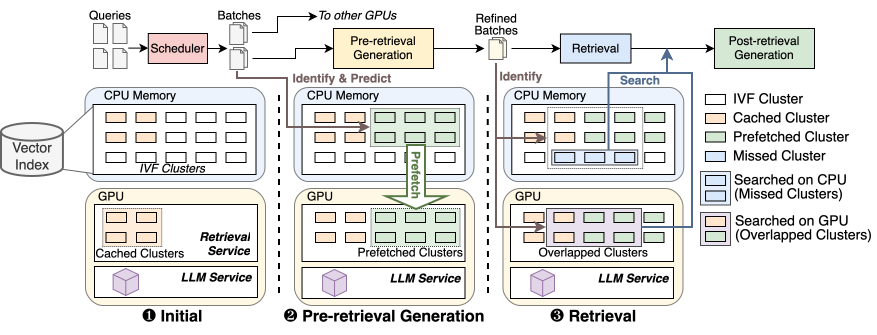

# TeleRAG: Efficient Retrieval-Augmented Generation Inference with Lookahead Retrieval

TeleRAG is an efficient inference system that reduces latency and improves throughput with minimal GPU memory requirements. The core innovation of TeleRAG is *lookahead retrieval*, a prefetching mechanism that predicts required data and transfers them from CPU to GPU in parallel with LLM generation. In addition, TeleRAG adopts a prefetching scheduler and a cache-aware scheduler to support efficient multi-GPU inference with minimal overhead.

This repo includes:

- TeleRAG's implementation: the `ragacc` library, which stands for RAG Acceleration.
- Scripts to run experiments and generate plots.

## Artifact Evaluation

Please refer to [docs/artifact-evaluation.md](docs/artifact-evaluation.md) for details.

## License

This project is licensed under the terms of the Apache 2.0 license. See [LICENSE](LICENSE) for more details.
